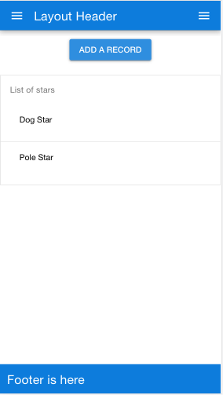

# quasar-template-meteor
Quasar Starter Kit for Meteor

(Updated 24th February 2019).

#### Quasar 1.0.0 beta
Quasar in npm is now found at quasar, not quasar-framework. And quasar-extras has moved to @quasar/extras.
There are a some breaking changes in 1.0.0 so the ui code has changed from version 0.17.


#### Meteor 1.8.0.2

This is a resource which will show how to install Quasar inside the Meteor framework, with Vue2 also installed.
First of all, this was forked from **https://github.com/Akryum/meteor-vue2-example-routing**
and then we added Quasar to that. So thankyou to Akryum for making Meteor work with Vue.

Unfortunately, there is a small problem with the meteor package called akryum:vue-router2.
Meteor 1.8 does not play nice with versions above akryum:vue-router2@0.2.0. 
So do not update to 0.2.2 for the moment.

#### We no longer have to transpile Quasar
With the arrival of **Meteor 1.7**, we just have to put a link to /node-modules/quasar-framework in the /imports folder
and then add some code on the server-side to indicate that we want to ignore legacy browsers
- please see setMinimumBrowserVersions() in /imports/startup/server/index.js

In this way Quasar compiles normally and we no longer get 'unexpected token: export' messages....

See this link for explanations of the changes that enabled this in Meteor 1.7:
https://github.com/meteor/meteor/blob/devel/History.md#v1421
 

#### Installation

**clone this repository:**

```
git clone https://github.com/quasarframework/quasar-template-meteor.git
```

**cd into the 'template' folder:**
```
cd quasar-template-meteor/template
```

**Install from npm**

```
meteor npm install
```

**Create a link to quasar in the /imports directory**

```
ln -s ../node_modules/quasar imports

```
(If you are doing this on *Windows* the link command is:
```
mklink /D "imports\quasar" "..\node_modules\quasar\"
```
 - thanks to Noboxulus for working this out)

**Create a link to the quasar-extras .woff files in the /public directory**
This makes the material-icons stuff appear

```
ln -s ../node_modules/@quasar/extras/material-icons/web-font public

```
(If you are doing this on *Windows* the link command is:
```
mklink /D "public\web-font" "..\node_modules\@quasar\extras\material-icons\web-font"
```
 - thanks to Noboxulus)


**run meteor (still inside the template folder)**

```
meteor
```

It should eventually say:
App running at: http://localhost:3000/

Point your desktop browser to that address.

Then if you open Chrome or Firefox dev tools and click on the mobile phone icon you should see this:


Please refer to guide.meteor.com/mobile.html for how to launch mobile apps on IOS and Android.

Meteor simplifies some of the difficulties of running your app on IOS for development 
(install Xcode, plug your phone into the USB port and call 'meteor run ios-device'), however
registering yourself as an Apple developer and working out how to register your app is a fairly frustrating experience. 

This project uses the Akryum projects to get Meteor working with vuejs and quasar-framework.
The most useful page to consult is:
https://github.com/meteor-vue/vue-meteor-tracker

This is the main page for all the Meteor/Vuejs projects:
https://github.com/meteor-vue/vue-meteor


#### Note:
The 'template' folder is a necessary part of the quasar framework.
However all meteor commands should only be run once you have moved inside the 'template' folder.
This extra 'template' folder is there because quasar-framework requires it. 
However, Quasar-framework uses Webpack for its builds, but Meteor has its own build system.
This means that it is unlikely that you will be able to use *quasar cli*, because it all leads up to a quasar build using webpack.

To use Meteor, just cd into the 'template' folder and run all your usual meteor commands from there.


